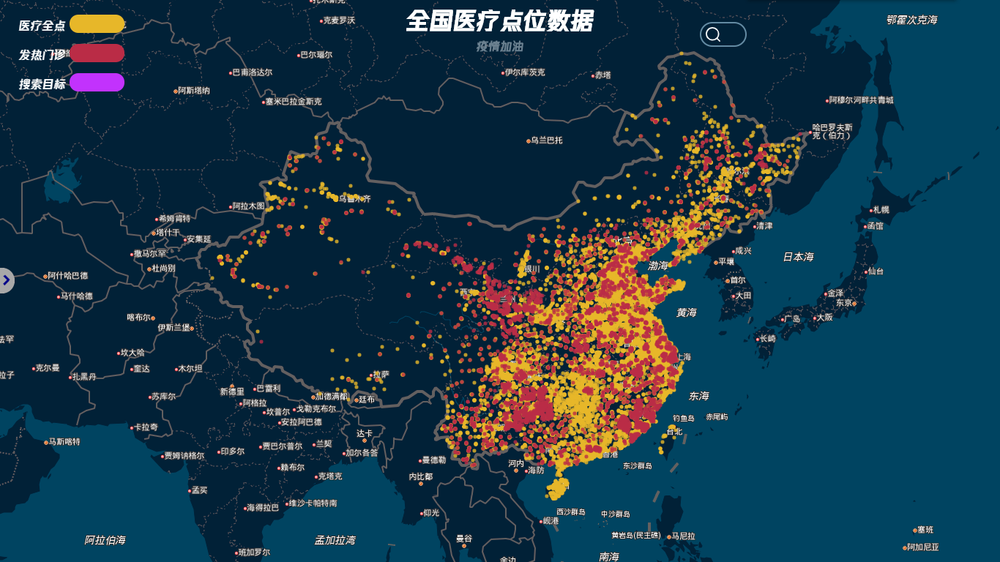
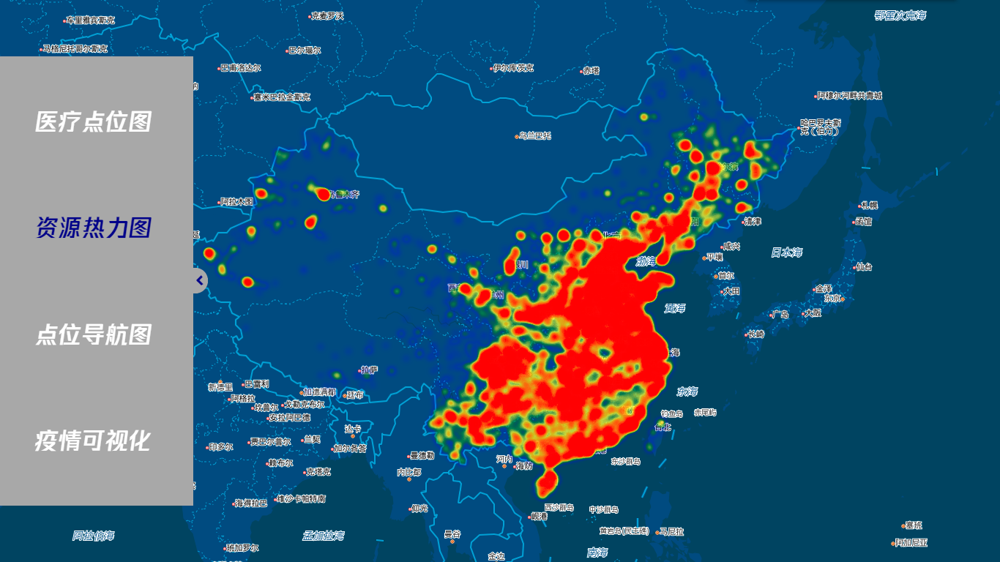
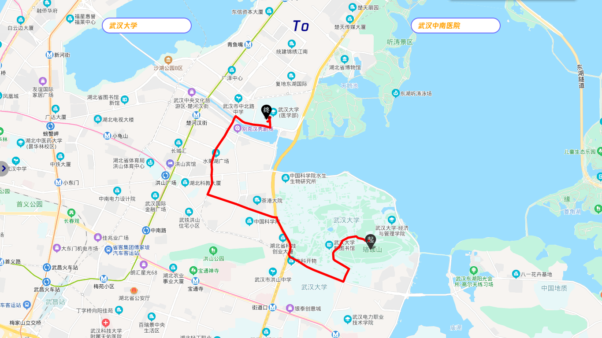
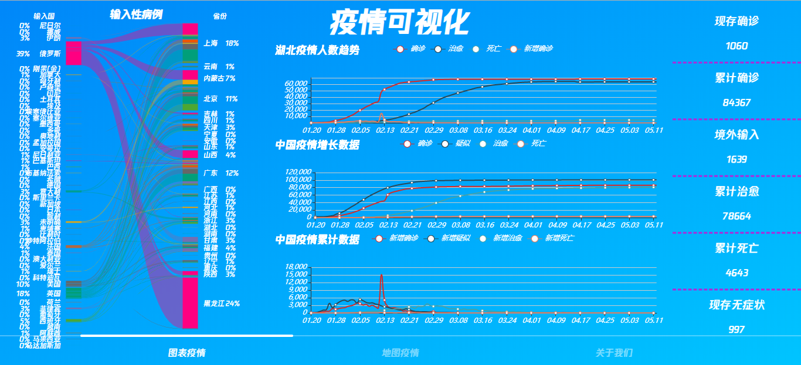
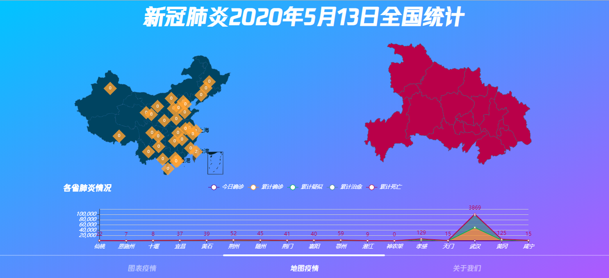
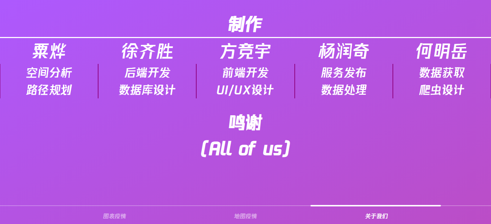

# medical-resource
 一个使用VUE搭建的关于医疗资源可视化系统 [http://bingchacha.top/medical-resource](http://bingchacha.top/medical-resource)

 PS:由于本人在这次课程项目小组中主要负责`UI/UX设计`以及`前端开发`，所以代码只涉及前端工程部分
 
 另外服务器比较辣鸡，同时数据量比较大，所以数据加载可能会`比较耗时`
 
 我一直觉得做完一个项目后有复盘才是完整的，它就像二次思考一样，你回首体会到了哪种场景下该用哪种技术来实现，以及领悟到可能由此处衍生出去的一系列知识，`项目复盘`写在了博客中欢迎访问： [第一次使用Vue开发小项目的感想与体会复盘](https://blog.csdn.net/ice_teas/article/details/106127636)

> page1 —— 医疗资源点位图

> page2 —— 医疗资源热力图

> page3 —— 附加功能：路径规划

> page4 —— 不同项目之间的一个入口

本地运行
---
```js
npm install
npm run serve
```

页面展示
---





